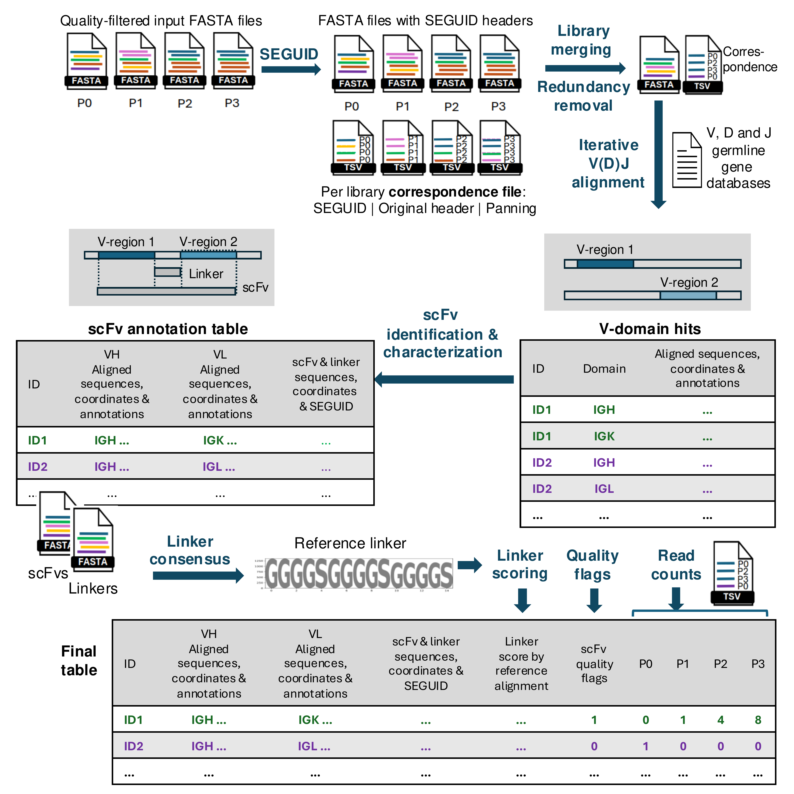
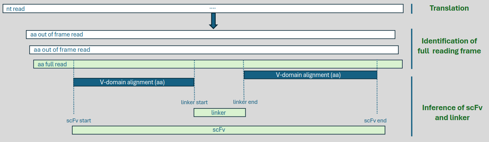
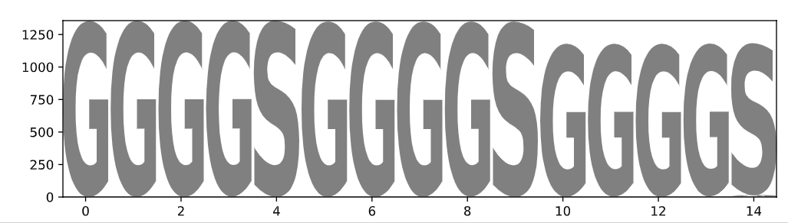

# Seq2scFv

## Table of Contents

- [Introduction](#introduction)
- [License](#license)
- [Abbreviations](#abbreviations)
- [Requirements](#requirements)
- [Workflow](#workflow)
1. [Input: Example Dataset & Preprocessing](#1-input-example-dataset--preprocessing)
2. [SEGUID, Library Merging, and Redundancy Removal](#2-seguid-library-merging-and-redundancy-removal)
    - [Usage](#usage)
    - [Example](#example)
    - [Output](#output)
3. [V(D)J Alignment](#3-vdj-alignment)
    - [Germline Gene Sequence Databases](#germline-gene-sequence-databases)
    - [Usage](#usage-1)
    - [Example](#example-1)
    - [Output](#output-1)
4. [scFv Delimitation and Characterization](#4-scfv-delimitation-and-characterization)
    - [Usage](#usage-2)
    - [Example](#example-2)
    - [Output](#output-2)
5. [Generating a Linker Consensus, Scoring Linkers and Full Dataset Overview](#5-generating-a-linker-consensus-scoring-linkers-and-full-dataset-overview)
    - [Usage](#usage-3)
    - [Example](#example-3)
    - [Output](#output-3)
6. [Flagging scFvs](#6-scfv-flags)
    - [Usage](#usage-4)
    - [Example](#example-4)
    - [Output](#output-4)
7. [Counting scFvs per library](#7-recovering-per-library-read-counts)
    - [Usage](#usage-5)
    - [Example](#example-5)
    - [Output](#output-5)


## Introduction 

This repository contains the tools described in *Seq2scFv: a toolkit for the comprehensive analysis of display libraries from long-read sequencing platforms*. The framework proposed enables the analysis of single-chain variable fragments (scFvs) from *in vitro* display experiments, providing full characterization of recombinant antibodies and quantification of identical scFvs across selection rounds to facilitate the identitifaction of binding candidates.

Seq2scFv include tools for: 

- **SEGUID**: Encoding sequences with a unique sequence identifier, to simplify redundancy removal and intra/inter experiment comparisons. 
- **Characterization of scFv**: Detailed analysis and annotation of single-chain variable fragments (scFv) through germline gene alignments and antibody numbering. 
- **Linker Inference**: Determining and annotating linker sequences within scFv constructs.
- **Flagging**: Identifying and marking sequences of interest based on specific criteria.
- **Tracking Sequence Enrichment**: Monitoring the prevalence of identical sequences across successive rounds of selection to identify potential high-affinity binders.

### License

Seq2scFv is under a license that grants non-profit organizations permission to use the software for internal research purposes, explicitly prohibiting any commercial use or sublicensing. For more details, please consult the `LICENSE` file. 

### Abbreviations
- **scFv**: Single-chain variable fragment.
- **HiFi**: High Fidelity read, derived from Circular Consensus Sequencing.
- **V-domain**: Variable domain.
- **VH**: Variable domain of the heavy chain.
- **VL**: Variable domain of the light chain.
- **FWR**: Framework region (FWR1 - FWR14)
- **CDR**: Complementarity determining region (CDR1 - CDR3, with H or L prefix indicating chain origin)
- **nt**: nucleotide
- **aa**: amino acid

### Requirements

Seq2scFv relies on several external tools and libraries. Ensure the following are installed:
- seqkit v. 2.7.0
- igBLAST v. 1.20.0 (we suggest to use the same version: newer versions might not be compatible with the algorithms presented here)
- clustalOmega v. 1.2.4
- R v. 4.0.0   
- Python 3.11.5

Versions of R packages:
```text
gridExtra version 2.3
ggplot2 version 3.4.1
dplyr version 1.1.1
stringr version 1.5.0
```

Also, the following Python libraries are required: 
```text
biopython v.1.79
antpack v.0.1.0
logomaker 0.8 # required separate Python version 3.6.9
matplotlib 3.3.4
``` 
### Workflow




## 1. Input: example dataset & preprocessing

We use publicly available data from Nannini et al. for this tutorial. You can access them from the original [publication](https://rdr.ucl.ac.uk/ndownloader/files/28624629). In `example_preprocessing.sh` we detail this information.  

If you have several libraries from different panning rounds, each library should be named after the panning round. In the case of Nannini et al. data, the name includes the antigen, the panning round (P0 - P3), and "CCS" (e.g., `CD160_P0_CCS.fastq`).

Quality preprocessing of the data is not part of Seq2scFv; we assume your data has already been:
- Demultiplexed
- Quality filtered
- Adapter and primer sequences removed:(including trimming of sequences used in PCR amplification).
- Reverse-complemented, to ensure all sequences are in the same orientation.
- Converted to fasta format, for compatibility with Seq2scFv tools.

Filtering out reads that fall outside the expected size interval is also recommended.

For an example of preprocessing, refer to the provided script: `example_preprocessing.sh`. The final preprocessed files, saved to `Example_dataset/1.Preprocessed`, are quality filtered, do not contain any primer sequences and have been size filtered (keeping only reads of 900 - 1200 bp). You can use any tool you prefer, as long as you end up with high-quality sequences in fasta format to continue analyses with Seq2scFv.

### 2. SEGUID, library merging, and redundancy removal

#### Usage

`uniq_id.py` replaces the headers in each fasta file with a Unique Sequence Identifier (SEGUID) that encodes the nucleotide sequence. It creates simultaneously a correspondence table for each fasta file, tracking each SEGUID, the original header, and the library of origin. The command simply requires stating `uniq_id.py basename fastq`, which provides the tool with the input fasta file, but also the basename to use for keeping track of each sequence's library of origin.  

Then, all fasta files are merged into a single one and redundancy is removed using `seqkit`. The per-library correspondence files are also merged. For more details about `seqkit` usage, please refer to their [documentation](https://bioinf.shenwei.me/seqkit/). 

#### Example

```bash
input_dir="Example_dataset/1.Preprocessed"

files=("${input_dir}/CD160_P0_CCS.filtered.adapt.sizetrim.fasta" \
       "${input_dir}/CD160_P1_CCS.filtered.adapt.sizetrim.fasta" \
       "${input_dir}/CD160_P2_CCS.filtered.adapt.sizetrim.fasta" \
       "${input_dir}/CD160_P3_CCS.filtered.adapt.sizetrim.fasta")

mkdir 2.Catalogued
cd 2.Catalogued

for fastq in "${files[@]}"; do
  basename=$(basename "$fastq" .filtered.adapt.sizetrim.fasta)
  ./bin/uniq_id.py $basename $fastq
done

cat *correspondence.tsv > merged.nt_correspondence.tsv
seqkit rmdup -n < <(cat CD160_P*_CCS.nt_seguid.fa) > merged.nt_seguid.fa
```
#### Output
The subset of the merged correspondence file, shown below, illustrates the table structure. First, the SEGUID which contains a "_nt_qual" suffix to indicate that the SEGUID is encoding a non annotated, quality filtered / trimmed read. The second column holds the CCS identifier, or original header of the fastq / fasta file. Finally, the "Library" column indicates in which sequencening library (aka pannig round) the specific sequence was identified.

| SEGUID                              | Original header                                                          | Library      |
|-------------------------------------|--------------------------------------------------------------------------|--------------|
| YkwcfdxHUjRSUQlMOFX1qNZGyeI_nt_qual | m161024_194428_42149_c101097032550000001823252803091753_s1_p0/163457/ccs | CD160_P0_CCS |
| cMrDw9ejMW4LVjOgFiGe6R6IFrY_nt_qual | m161024_194428_42149_c101097032550000001823252803091753_s1_p0/163460/ccs | CD160_P0_CCS |
| jY+wEWyXLgauO5FN37L1bzvTzr8_nt_qual | m180331_051314_42149_c101464612550000001823297908121820_s1_p0/257/ccs    | CD160_P1_CCS | 
| /v7UgkYbdLB4kQOdk0ErwANEX8c_nt_qual | m180331_051314_42149_c101464612550000001823297908121820_s1_p0/419/ccs    | CD160_P1_CCS | 

                       
### 3. V(D)J alignment 

After merging all libraries and removing the redundancy, the next step in Seq2scFv consists in the iterative V(D)J alignment to germline genes. Here, IgBLAST is used in a Python script to identify a first V-domain; once it is identified, adjacent regions are split, and if they meet a user-defined length threshold, the read fragments are submitted to a new IgBLAST search. This iterative process annotates all possible V-regions within a read until no additional splitting is possible. 

#### Germline gene sequence databases
Seq2scFv is flexible in terms of the germline gene databases used, thanks to IgBLAST. The only requirement is that they must be formatted correctly, especially the auxiliary files. For detailed instructions on formatting, refer to the IgBLAST setup guide available [here](https://ncbi.github.io/igblast/cook/How-to-set-up.html). IgBLAST provides auxiliary files for both IMGT, NCBI and some OGRDB databases.

For the example dataset, we aligned germline gene databases from *Rattus norvegicus* IMGT database, available [here](https://www.imgt.org/vquest/refseqh.html ) and formatted according to IgBLAST web instructions. The auxiliary file, which contains additional information for each J gene to facilitate CDR3 annotation, was obtained from the IgBLAST directory. 


#### Usage

`vscan_functions.py` requires several parameters, detailed in the table below:


| Parameter          | Type   | Required | Description |
|--------------------|--------|----------| ------------|
| `--query`          | string | required | Input file name for DNA sequences in fasta format. | 
| `--germline_V`     | string | required | Path to the V germline database. |
| `--germline_D`     | string | required | Path to the D germline database  |
| `--germline_J`     | string | required | Path to the J germline gendatabasees.  |
| `--auxiliary_data` | string | required | Path to the IgBLAST auxiliary file, containing the coding frame start postiitons for sequences in germline J database. |
| `--organism`       | string | required | Organism of the query sequence: 'human', 'mouse', 'rat', 'rabbit' or 'custom' (see IgBLAST web site). |
| `--ig_seqtype`     | string | optional | Receptor sequence type: 'Ig' or 'TCR'. Default: 'Ig'. |
| `--domain_system`  | string | optional | Domain system to be used for segment annotation: 'imgt' or 'kabat'. |
| `--num_threads`    | int    | optional | Number of threads (CPUs) to use in the BLAST search. Default: 1. |
| `--minlen`         | int    | optional | Minimum length (bp) required to continue seraching for a V-domain. Default: 150 bp.  |
| `--escore`         | float  | optional | Minimum V and J alignment support (E, expectation value) to consider a hit fully characterizing a V-(D)-J region. Default: 0.01. |


#### Example
```bash
# Example of user input
fasta="Example_dataset/2.Catalogued/merged.nt_seguid.fa"
ig_seqtype="Ig"
ig_threads="8"
organism="rat"
domain_system="imgt"
minlen="150"
escore="0.01"
# path to your germline genes databases
germline_db_V="/path_to_IgBLAST_formatted/rat_gl_V"
germline_db_D="/path_to_IgBLAST_formatted/rat_gl_D"
germline_db_J="/path_to_IgBLAST_formatted/rat_gl_J"
auxiliary_data="/path_to_IgBLAST_files/optional_file/rat_gl.aux"

mkdir 3.vscan
cd 3.vscan

./bin/vscan_functions.py --query $fasta \
      --germline_V $germline_db_V \
      --germline_D $germline_db_D \
      --germline_J $germline_db_J \
      --organism $organism  \
      --ig_seqtype $ig_seqtype  \
      --domain_system $domain_system \
      --auxiliary_data $auxiliary_data \
      --num_threads $ig_threads \
      --minlen $minlen \
      --escore $escore
```

#### Output 
The output of this process is a single [AIRR-compliant](https://docs.airr-community.org/en/stable/datarep/rearrangements.html) table (`igblast.tsv`),  with one hit per row, indicating one V-domain and its V(D)J alignment. This table includes information such as:
- matched germline genes and locus origin (IgH, IgK or IgL) 
- nt and aa alignment sequences (query and germline)
- alignment coordinates (adjusted to reflect the original sequence, not the split regions provided iteratively)
- alignment scores
- nt and aa FWR and CDR sequences
- nt CDR alignment coordinates
- quality annotations, such as presence of stop codons, frameshifts or whether the alignment is reverse-complemented relative to the query

For a detailed description, please read the [AIRR V(D)J rearrangment schema documentation](https://docs.airr-community.org/en/stable/datarep/rearrangements.html), or refer to the column description included in this repository. 

The process also generates intermediate files (ddDNA*), but subsequent steps in Seq2scFv only require the final one (`igblast.tsv``).


### 4. scFv delimitation and characterization

`scFv_splitter.py` gathers the information obtained from IgBLAST annotation, identifies putative scFvs and characterizes them thorougly. 

The first step consists in identifying reads with exactly 1 VH and 1 VL. Only well delimited V-domains (no NAs for the V gene start nor J gene end) from the IgBLAST output are considered. To gather the dataframe in a 1 row per-read (or per-scFv) format, a "VH" or "VL" prefix is appeneded to all columns reporting VH and VL V(D)J alignment information, respectively, before combining the information. Unpaired sequences, or sequences with more than 1 VH or VL, are written to `igBLAST_non_paired_nondelim.tsv`. 

Sequences without stop codons in the aa alignment, as reported by IgBLAST, are then annotated. These aa alignments are also leveraged to identify the translation frame for the full read, which corresponds to the frame that present both VH and VL aa alignments. The coordinates of both V-domains allow to slice the aa scFv sequence within the aa read, as shown in the schema below, generating new columns that contain the inferred scFv and linker subsequences as well as their start and end coordinates. The coordinates, together with the frame, are used to infer the coordinates at the nucleotide level and extract the inferred nucleotide scFv and linker subsequences. "SEGUID_aa_scFv" and "SEGUID_nt_scFv" identifiers are provided for the scFv sequences. Further annotation consists in generating (for aa) or updating (for nt) all the coordinates indicating FWR & CDR alignments relative to each V-domain and no the full read (simplifying downstream analyses).  

Seq2scFv also provides characterization of scFvs through V-domain numbering using Antpack. For each VH and VL, a field is provided with a list of numbers corresponding to the residues of the aa VH or VL alignments. Additionally, the congruence between numbering and V(D)J alignment is evaluated. This consists in determining whether IgBLAST and Antpack agree on the V-domain start position and length. 



#### Usage

This script requires one input file and one parameter specification. 

```
scFv_splitter.py --igBLAST-hits igBLAST.tsv --domain-type domain_system
```

| Parameter          | Type   | Required | Description |
|--------------------|--------|----------| ------------|
| `--igBLAST-hits`   | string | required | Path to IgBLAST hits stemming from V-scan. | 
| `--domain-type`    | string | required | Domain system to be used for segment annotation: 'imgt' or 'kabat'|

#### Example
```bash
# Example of user input
hits="Example_dataset/3.vscan/igBLAST.tsv"
domain_system="imgt"

./bin/scFv_splitter.py --igBLAST-hits $hits --domain-type $domain_system 
```

#### Output

The main output is written to `in_frame_igBLAST_paired_delim.tsv`. This contains fully annotated and validates sequences of scFvs (presenting exactly 1 VH & 1 VL and without any stop codons in the full scFv sequence). 

Discarded sequences are written to: 
- `in_frame_igBLAST_delim_nonstandard_aas.tsv`: for paired VH-VL sequences presenting non standard aminoacids. 
- `out_of_frame_igBLAST_paired_delim.tsv`: for sequences with stop codons in any portion of the scFv, or with incongruent frames between the VH and VL. 

Additionally, 4 fasta files are generated containing: 
- nt scFv sequences
- aa scFv sequences
- nt linker sequences
- aa linker sequences 

Both the nt and aa scFv fasta files present non-redundant scFvs. The header contains the \*_aa_scFv ID, as well as the read ID from which the scFv was identified (*_nt_qual; can present more than one, separated by ";", if several reads converge in the same delimited scFv). 

### 5. Generating a linker consensus, scoring linkers and full dataset overview

Seq2scFv can characterize scFvs through a systematic and detailed evaluation of the inferred linker sequences, which might differ from the designed linker because of mutations or annotation. For example, the alignment may struggle to correctly identify its position in the read and infer the accurate start and end coordinates of the linker sequence if an unusual V or J gene is present in one of the V-domains or if numerous mutations were introduced during somatic hypermutation (SMH). Reporting these linker sequence discrepancies allows for a more thorough assessment of annotation quality.

Identifying divergences in linker sequences needs, first, a reference sequence. This is ideally the amino acid sequence of the linker used in the construction of scFvs. As this information may not always be available, the framework in Seq2scFv can independently identify the linker from the data. The linker sequences we refer to are: 

- **Provided linker**: the linker sequence used for constructing the scFvs, known beforehand (e.g. provided by the lab).
- **Inferred linkers**: the linker identified within each read following scFv delimitation
- **Consensus linker**: the most common linker sequence deduced from the data, by alignment of a random sample of inferred linkers
- **Reference linker**: if available, it refers to the provided linker; otherwise, it refers to the consensus linker. This is used to score, by alignment, all inferred 


#### Usage
*Consensus linker and scoring*

To identify the consensus linker, we first align the inferred linkers. As MSAs are computationanly demanding, we recommend inferring the linker on a random subset of samples. Here, we use `seqkit` for the subsampling 10% of the linkers, and `clustlOmega` for the alignment. The example below details its usage. Any alternative can be used. This is conducted simultaneously both at the nucleotide and the amino acid levels.  

Next, `get_logos.py` is used to generate sequence logos and deduce the consensus linker. 

```bash
get_logos.py --nt-aln nt_inferred_linkers.aln --aa-aln aa_inferred_linkers.aln --check-linker 'undefined'`
```

| Parameter        | Type   | Required | Description |
|------------------|--------|----------| ------------|
| `--nt-aln`       | string | required | Path to the nt linker alignment | 
| `--aa-aln`       | string | required | Path to the aa linker alignment |
| `--check-linker` | string | required | Provided (known) aa linker sequence to compare to inferred consensus linker. If not known: 'undefined'|

If the linker is "undefined", `get_logos.py` will write the consensus linker to `aa_reference_linker.fasta`. If you provide a linker sequence, this will be written to `aa_reference_linker.fasta`. Additionally, the provided linker and the inferred consensus are compared and the result is notified under `inferred_vs_provided_linker_evaluation.txt`. 

Then, the reference linker is used to score all the inferred linkers of the full dataset (`in_frame_igBLAST_paired_delim.tsv`). 

```bash
linker_scorer.py --scFv in_frame_igBLAST_paired_delim.tsv --linker aa_reference_linker.fasta
```

| Parameter  | Type   | Required | Description |
|------------|--------|----------| ------------|
| `--scFv`   | string | required | TSV file containing annotations of all in-frame scFv. Default: in_frame_igBLAST_paired_delim.tsv | 
| `--linker` | string | required | Reference linker sequence. Default: aa_reference_linker.fasta |

*Overview of inferred linkers across the dataset*

Seq2scFv also provides R scripts for the characterization of the inferred linker sequences across the dataset: 
- **linklengths.r**: histogram of the inferred linker lengths (in bp and aa)
- **top linkers.r**: top 10 most frequent inferred linkers (in nt and aa)

#### Example

```bash
# Consensus linker and scoring
aalink="Example_dataset/4.scFv_split/aa_inferred_linkers.fasta"
ntlink="Example_dataset/4.scFv_split/nt_inferred_linkers.fasta"
scfvs="Example_dataset/4.scFv_split/in_frame_igBLAST_paired_delim.tsv"
linksample=0.1

cat ${ntlink} | seqkit sample -p $linksample -o nt_inferred_linkers_${linksample}_sampled.fasta
clustalo --use-kimura -i nt_inferred_linkers_${linksample}_sampled.fasta -o nt_inferred_linkers.aln  

cat ${aalink} | seqkit sample -p $linksample -o aa_inferred_linkers_${linksample}_sampled.fasta
clustalo --use-kimura -i aa_inferred_linkers_${linksample}_sampled.fasta -o aa_inferred_linkers.aln  

get_logos.py --nt-aln nt_inferred_linkers.aln --aa-aln aa_inferred_linkers.aln --check-linker 'undefined'

../bin/linker_scorer.py --scFv $scfvs --linker aa_reference_linker.fasta
```
```bash
# Linker overview across the dataset
# Get linker lengths
echo -e "ID\tlength" > nt_inferred_linkers_lengths.tsv
bioawk -c fastx '{ print $name, length($seq) }' < ${ntlink} >> nt_inferred_linkers_lengths.tsv
echo -e "ID\tlength" > aa_inferred_linkers_lengths.tsv
bioawk -c fastx '{ print $name, length($seq) }' < ${aalink} >> aa_inferred_linkers_lengths.tsv
linklengths.r nt_inferred_linkers_lengths.tsv aa_inferred_linkers_lengths.tsv 

# Most frequent linkers
top_linkers.r $scfvs aa_reference_linker.fasta
```
#### Output

The process of determining the consensus linker results in both nucleotide and amino acid consensus linkers. Depending on whether a linker sequence was provided:
- **No linker sequence provided**: The aa consensus linker becomes the aa reference linker.
- **Linker sequence provided**: The provided aa linker sequence becomes the aa reference linker, and a congruence evaluation is performed (`inferred_vs_provided_linker_evaluation.txt`).

Sequence logos are generated for both the aa and nt consensus linkers in PDF format (`*_linkers_logo.pdf`). For the test dataset (randomly subsampled), for example, the linker aa sequence is: 



The scFv sequences from the TSV file are annotated with four additional columns. To understand these annotations, let's explore the scoring system used:
- Smith-Waterman algorithm (local alignment).
- Scoring parameters:
- Match: +1
- Mismatch: 0
- Gap opening penalty: -10
- Gap extension penalty: 0.5

The alignment focuses on the best match and reports this without adding gaps on the flanks.
```
Sequence: GGGGSGGGGFRWEEDQEAVGS
Score: 9.0
target            0 GGGGSGGGG 9
                  0 ||||||||| 9
query             0 GGGGSGGGG 9


Sequence: GGGGSGGGGSGGGGS
Score: 15.0
target            0 GGGGSGGGGSGGGGS 15
                  0 ||||||||||||||| 15
query             0 GGGGSGGGGSGGGGS 15

Sequence: GGGDSGGGGSGGGGSGGGGSN
Score: 14.0
target            0 GGGGSGGGGSGGGGS 15
                  0 |||.||||||||||| 15
query             0 GGGDSGGGGSGGGGS 15
```
Annotated Columns
- **score_pcnt**: Aligned amino acids (score) relative to the length of the reference linker sequence, in percent
- **mismatches**: Number of mismatches between the aligned reference and inferred linkers 
- **linker_overhang**: Number of non-aligned amino acids in inferred linkers

This information allows the user to decide on the acceptable number of mismatches, linker overhang, and minimal identity percent with the reference linker at a later stage.

Examples: 
|sequence_id			  |aa_linker				        |score_pcnt	|mismatches	  |linker_overhang|
|-------------------|-------------------------|-----------|-------------|---------------|
|ccs_655992_P3		  |GGGGSGGGGFRWEEDQEAVGS	  |45.0		    |0.0			    |12.0           |
|ccs_10946940_P3		|GGGGSGGGGSGGGGSGGGGSDIL	|100.0		  |0.0			    |3.0            |
|ccs_11011057_P3		|GGGGSGGGGSGGGGSGGGGS	    |100.0		  |0.0			    |0.0            |
|ccs_137495258_P3	  |GGGDSGGGGSGGGGSGGGGS	    |95.0		    |1.0			    |0.0            |

Seq2scFv also generates a set of plots and tables that allow the user to evaluate the linker sequences identified in the dataset, as a measure of annotation quality. 

For example, the user can inspect all the linker lenghts, with a particular focus on the linkers centered around the 5th and 95th length percentiles. This is provided both at the nt and aa levels, written to a table (`*_inferred_linkers_length.tsv`) and plotted as an histogram `(*_inferred_linkers_length.png)`. 

 

Additionally, a table is provided with the 10 most frequently observed linker sequences, both at the nt and aa levels (`*_top10_linkers.tsv`). In indicates the linker sequence, the number of times it was observed and the frequency, relative to the total number of linkers detected. For the aa linker, an additional column indicates wheter the reference linker matches (or partially matches) the reference liner. 

### 6. scFv flags
Quality flags can be added using Seq2scFv tools to aid in downstream analysis and filtering based on predefined criteria. These flags use binary annotations (0/1) to indicate whether an scFv meets specific quality thresholds. The criteria evaluated include: 
- Correct order of VH and VL domains (firsth VH).
- Linker annotation quality, defined by user thresholds for:
    - Alignment score.
    - Number of mismatches.
    - Length of the linker overhang.
- Meet IgBLAST criteria for being "productive", for both V-domains:
    - V(D)J rearrangement frame is in frame.
    - No stop codon is present.
    - No internal frame shifts in the V gene.
- Meet IgBLAST criteria for being "complete", for both V-domains:
    - Sequence alignment spans the entire V(D)J region from the first V gene codon to the last complete codon of the J gene
   

#### Usage
```bash 
scfv_flags.py --scFv in_frame_igBLAST_paired_delim_linker_scored.tsv --linker-min-id $pcntlinkID --mismatches $maxmismatches --linker-overhang $maxlinkeroverhang --chain-length $chain_min_aa_len
```
| Parameter             | Type   | Required | Description |
|-----------------------|--------|----------| ------------|
| `--scFv`              | string | required | TSV file containing annotations of all in-frame scFv.| 
| `--linker-min-id`     | string | optional | Flag scFvs with a linker score (%) lower than the selected threshold. Default: 90.|
| `--mismatches`        | string | optional | Flag scFvs with a linker presenting more mismatches than the selected threshold. Default: 2.|
| `--maxlinkeroverhang` | string | optional | Linker overhang (in number of aa) allowed relative to the reference linker. Default: None. |
| `--chain-length`      | string | optional | Minimum V-domain length in aa. Default: None. |

#### Example
```bash
linkerscored="Example_dataset/5.Linkers/in_frame_igBLAST_paired_delim_linker_scored.tsv"
pcntlinkID="90"
maxmismatches="2"
maxlinkeroverhang="undefined"
chain_min_aa_len="80"

scfv_flags.py --scFv ${linkerscored} --linker-min-id $pcntlinkID --mismatches $maxmismatches --linker-overhang $maxlinkeroverhang --chain-length $chain_min_aa_len
```
#### Output

The result of the flagging step is the scFv annotation table (generated with `scFv_splitter.py` and extended with `linker_scorer.py`), presenting additional columns where the values are 1 if: 
- **VH_IGH**: the first domain in the scFv is a VH 
- **linker_pass**: the linker in the scFv passes all the linker quality thresholds
- **productive_scfv**: both the VH and VL are productive (according to IgBLAST's definition)
- **complete_scfv**: both the VH and the VL are complete (according to IgBLAST's definition)
- **min_chain_aa_len**: both the VH and the VL meet the minimum length criteria. 


### 7. Recovering per-library read counts

#### Usage
```bash 
ntqual_counts.py --scFv in_frame_igBLAST_paired_delim_linker_scored_flags.tsv --correspondence merged.nt_correspondence.tsv --focus-libraries ${liborder}
```

| Parameter             | Type   | Required | Description |
|-----------------------|--------|----------| ------------|
| `--scFv`              | string | required | TSV file containing annotations of all in-frame scFv returned by flagging process.| 
| `--correspondence`    | string | required | Correspondence file generated by merging of uniquely-tagged libraries.|
| `--focus-libraries`   | string | required | Text file with the basename, one per line, of all provided libraries.|

#### Example

The text file with the library basenames (`focus_libs.txt`) simply reads: 
```text
CD160_P0_CCS
CD160_P1_CCS
CD160_P2_CCS
CD160_P3_CCS
```

```bash
scFv="Example_dataset/6.Flags/in_frame_igBLAST_paired_delim_linker_scored_flags.tsv"
corr="Example_dataset/2.Catalogued/merged.nt_correspondence.tsv"
libs="Example_dataset/focus_libs.txt"

ntqual_counts.py --scFv $scFv --correspondence $corr --focus-libraries $libs
```

#### Output
The count columns are appended to the scFv annotation table. As an example, below is a subset of the table. Each row represents a unique read (adapter-trimmed and quality-filtered). The number of times each read has been observed in each of the panning rounds is shown in the last columns. As the table provides information such as the scFv sequence (at the aa or nt level), or the HCDR3, the user is able to aggregate the counts according to the region of interest, facilitating the analysis of its amplication across selection rounds.  

|sequence_id			                      |...|VH_cdr3_aa   |...|CD160_P0_CCS|CD160_P1_CCS|CD160_P2_CCS|CD160_P3_CCS|
|---------------------------------------|---|-------------|---|------------|------------|------------|------------|
|7sMPlp1+etZjpoTa2IWgsSE0GKk_nt_qual		|...|ARLPGYNLDY   |...| 	        1| 	         0| 	        0| 	         0|
|nOqbbtP1/NQ8dnPU/Nc08cXECr4_nt_qual		|...|VRGTTGAMDA   |...| 	        1| 	         0| 	        0| 	         0|
|qgGUJU90Lih2bvWlkvLUQhc7XoU_nt_qual		|...|ARAYYFGDGFAF |...| 	        1| 	         0|           0| 	         0|
|...                                		|...|...          |...| 	      ...| 	       ...|         ...| 	       ...|
|1ulPjpfXBNlwsciwgDodsheMtCk_nt_qual		|...|VTHNYESTVFDY |...| 	        0| 	         0| 	       66| 	        18|
|U3uTNORc0JdEmGIydlaSkVGwdEA_nt_qual 		|...|ATHNYESTVFDY |...| 	        0| 	         0| 	       55| 	        16|
|A1V4+e/5Fl2NPZc/EAbJVSyduPc_nt_qual 		|...|ATHNYESTVFDY |...| 	        0| 	         2| 	       47| 	        15|
|m+oVmm/JMyjs61pwVskDrcO6tAI_nt_qual		|...|ATHNYESTVFDY |...| 	        0| 	         1| 	       44| 	        28|


The full description of all the annotation columns is provided under `annotation_columns.xlsx`. 